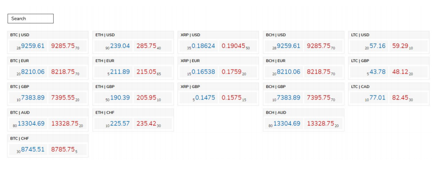

## Market View (Front End)

As we mainly work with trading markets, the technical task is to create a Whiteboard of trading
instruments called Market View.

### Technical requirements:

1. You can use Angular, React or Vue.js.
2. You can use npm/yarn package manager to manage dependencies.
3. Optionally, you can use any CSS framework (Tailwind CSS, Material UI, Bootstrap, etc.)
4. Having unit tests using Jasmine, Jest or any other testing framework, as an advantage.
5. Application can support Google Chrome browser.
6. Deliver the code either in Github or as a zip file.
7. Make sure to document your project in a simple README.md file so it would be easier for us
to set up, run and test your application.

### Business requirements:

<ol>
<li>Market view wireframe:</li>

<li>The client application should be a single page application with 2 components:</li>
<ul>
<li>The market view which should show a list of instrument tiles grouped by left
currency. Each instrument tile should contain:</li>
<ul>
<li>Currency pair</li>
<li>Bid side info (price and amount) on the left side of instrument</li>
<li>Offer side info (price and amount) on the right side of instrument</li>
</ul>
<li>Search input field on the top of the screen. It should filter instruments by currency
pair (full or partial match).</li>
</ul>
<li>There should be real-time updates logic making prices/amounts to change on the fly. The
price/amount of any instrument (in the Market View) should be updated once a second with a
different value.</li>
<li>Instruments will be provided in an instruments.json file and should be fetched using HTTP
request.
</li>
</ol>

### Guidelines and Tips

<ul>
<li>Implement best practices on how you see fit.</li>
<li>Using Typescript is an advantage.</li>
<li>Design the page in such a way that it is user-friendly. Layout-wise, device-wise, etc.</li>
<li>The minimum business requirements are defined in step 1 above. But feel free to add
components to make the application easier to use (charts, help links, tooltips, etc.).
</li>
<li>Be resourceful. The internet is at your disposal.</li>
<li>The more you put in the more we can appreciate your time and effort</li>
<li>Bring out your inner Da Vinci! Be creative, innovative and original. Make this your
masterpiece.</li>
</ul>