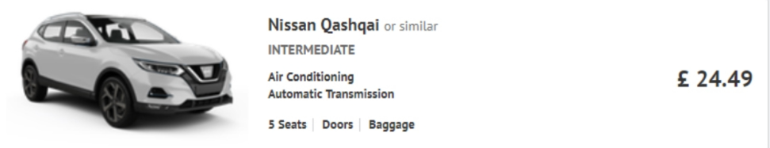

## Goal

To create a filter and show chosen filters which would look like this:

## Requirements

- Use ReactJs, node.js, Graphql, redux, jsx, antd
- Use API endpoint https://sampledata.bookinggroup.com/carlist.json (if it goes down, [here](./_data.json) is a copy)
- Example of fillters (here are used suppliers array fields - logo, id)

- Amount of filtered items should be displayed
- Display filtered items. When no filters are applied, dispay all items
- Use car array and display information found in it (name - car name, imageUrl - picture of a car, seats, doors, transmission: 1 - manual, 2 - automatic, airco - airconditioning, bigSuitcases - luggage, total - price, currency)

- Display supplier logo and rating

- Add sorting options based on used filters, for an example

- On each page display only 10 results
- It should be possible to navigate between pages

## Additional requirements

- Filters, sorting option, pagination is working after switching pages

- Used design should be as similar as possible to design in given examples
