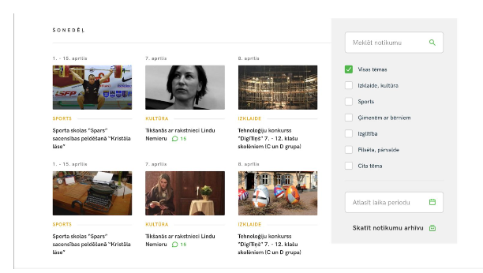

## Goal

To create a responsive event list with filter option from available mock data (mock_data2019.json) similar as in a picture ( desktop version). You can create a mobile and tablet view as you like.

## Requirements

- Sort events by date in ascending order. At the beginning show the first six events (they don't have to be just the current week's events). You can use paging or lazy loading to show more events
- It must be possible to filter by category
- Results selection should be dynamic, without reloading the page
- It must be possible to filter the event by time period by indicating it in the visual calendar
- You do not need to create an event archive
- The style must be written in Sass files.

## Additional requirements
- When filtering an event by time period in the visual calendar, highlight the days on which there are any events
- TypeScript is recommended
- You can use the tools and libraries of your choice. It is desirable to then justify the choice.
