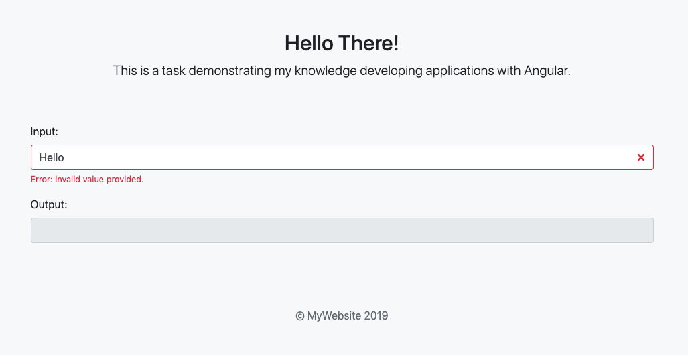

## Goal

Using [Angular] create a form with UI (user-interface) as in a picture below.

## Requirements

- When a number is typed in input field, a disabled text input field should be updated with "Foo" if the input is divisible by 3, "Bar" if the input is divisible by 5 and "FooBar" if the input is divisible by 15.

- If the input is NOT divisible by 3 or 5, the disabled text field should be empty. If the input is NOT a number, an error message should be shown to the user and the disabled text field should be empty.

- The full source code must be pushed to a public Github repository. Link to this repository must be sent to KASKO.

[Angular]: https://angular.io/