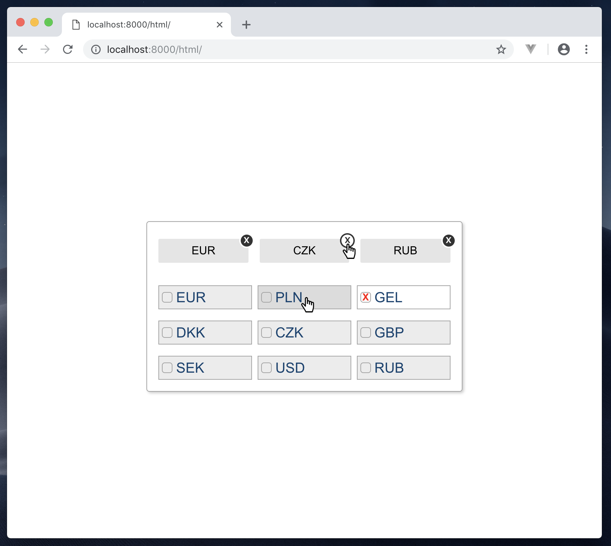
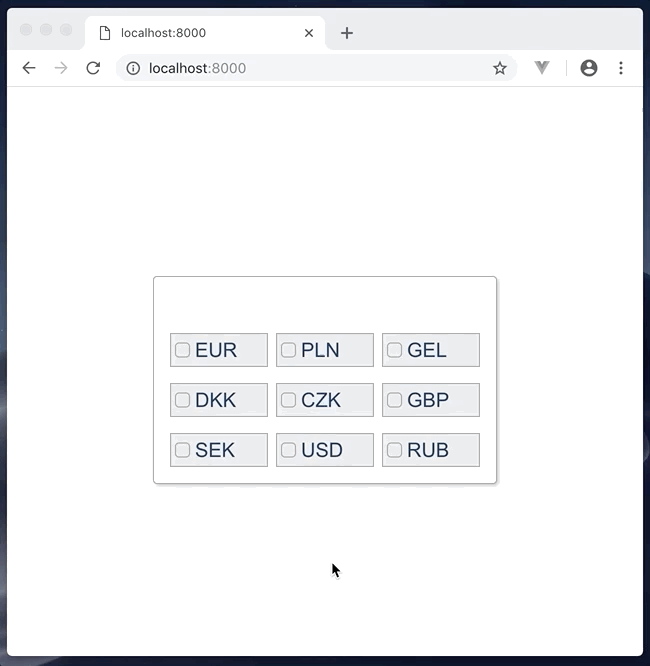

# Task #1

In the attachment of this email, you will find a screenshot. 

Your task is to create the HTML and CSS for the currency selection component to implement the following design.

# Task #2

Enhance the result of the previous task by creating a mini application (you can use any technology, but Vue.js is a preferred choice).

See the attached gif file for an example of the desired behavior.

The goal is to add currency selection functionality so that:

- when the user clicks on one of the currencies it should add and display it in the list of selected currencies
- if the currency is already selected, it should unselect the currency and remove it from the list of selected currencies
- in addition, when the user clicks on the dark remove icon - "X" (the top-right icon on a selected currency item), it should unselect the currency and remove it from the list of selected currencies

