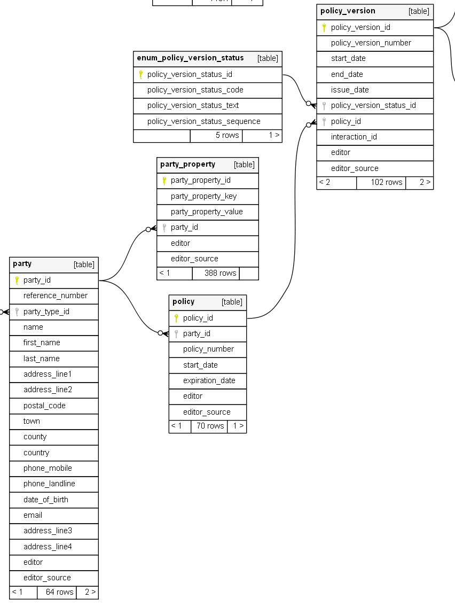
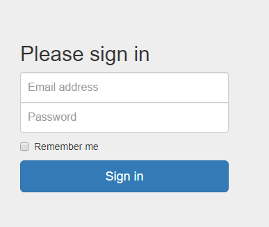
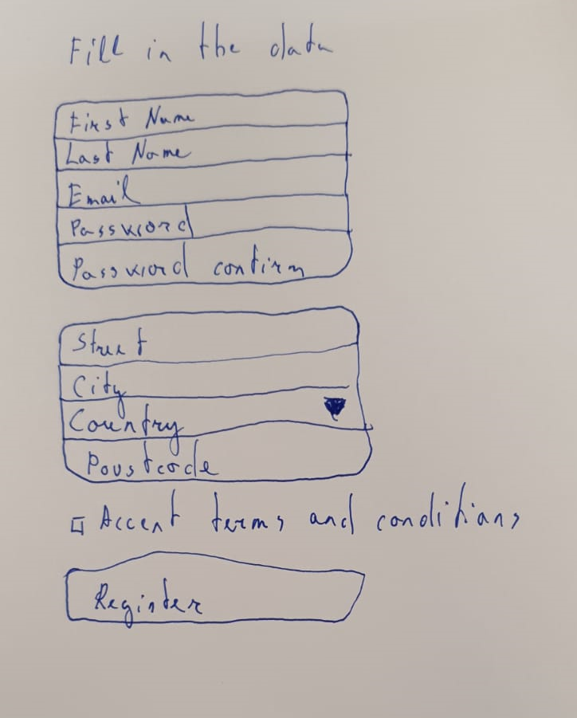

# SQL



1. Select all policies that start before 14.11.2019
1. Select all policies that are active during the period from 14.10.2019 to 14.11.2019
1. Select all parties with a number of policies for each
1. Select the last policy version for each policy

# C#

Implement a console application transforms xml file to json file.
XML file format:

```xml
<root>
    <element>
        <variable1>15</variable1>
        <variable2>2</variable2>
    </element>
    <element>
        <variable1>4</variable1>
        <variable2>4</variable2>
    </element>
</root>
```

JSON file format:

```json
[
  {
    "divided": 7.5,
    "multiplied": 30
  },
  {
    "divided": 1,
    "multiplied": 16
  }
]
```

divided = variable1/variable2;

multiplied = variable1\*variable2;

Must use OOP and Solid principles.

Must implement exception handling.

Must implement unit tests.

Must use following interfaces:

```c#
public interface IElementReader {
      List<IInputElement> Read(string filePath);
}


public interface IElementWriter {
      void Write(List<IOutputElement> elements, string filePath);
}
```

For JSON serialization use https://www.newtonsoft.com/json
For XML serialization use XmlSerializer.

Example how to deserialize file
NB! It's not fully working code! It's just an example.

```c#
[XmlRoot(ElementName = "root")]
public class InputFileRoot
{
    [XmlElement(ElementName = "element")]
    public List<IInputElement> Elements { get; set; }
}

[XmlRoot(ElementName = "element")]
public class Element : IInputElement
{
    [XmlElement(ElementName = "variable1")]
    public double Variable1 { get; set; }

    [XmlElement(ElementName = "variable2")]
    public double Variable2 { get; set; }
}

var serializer = new XmlSerializer(typeof(InputFileRoot));
InputFileRoot root = null;

using (Stream reader = new FileStream(filePath, FileMode.Open))
{
    root = (InputFileRoot)serializer.Deserialize(reader);
}

```

# HTML & CSS

Using login page (https://getbootstrap.com/docs/3.3/examples/signin/) as sample :



create registration page:


