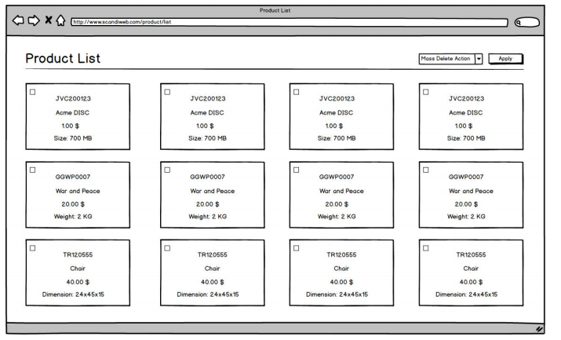
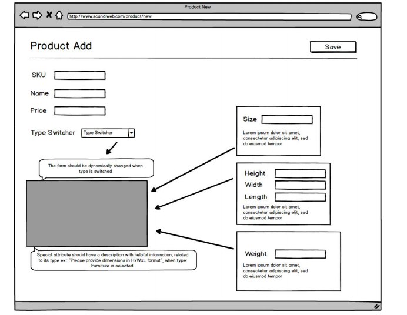

## Prepare
Before doing the test, please make sure to go through these resources. If you don’t understand
some of the topics covered in those resources, please make sure to invest time in learning
them. It will help you a lot when doing the Junior test

Khan Academy
https://www.khanacademy.org/

You can join as a student so we can track your progress and propose some additional courses
You can do that by visiting: khanacademy.org/coaches and entering 3 2DDEH i n the "Join a
class" section

- [HTML, CSS](https://www.khanacademy.org/computing/computer-programming/html-css) - Free, interactive and good for basics
- [HTML, JavaScript](https://www.khanacademy.org/computing/computer-programming/html-js-jquery) - Free, interactive and even includes jQuery
- PHP the right way http://www.phptherightway.com/

## Assignments

### General requirements:
- PHP: ^7.0, plain classes, no frameworks, OOP approach
- jQuery: optional
- jQuery-UI: prohibited
- Bootstrap - optional
- SASS - advantage
- MySQL: ^5.6 - obligatory
- PSR-1/2 - optional
- Code should be shared as bitbucket repository

<strong>Not included in original assignment, but clarified with company later:</strong> 
&rarr; VanillaJS with Ajax It's not restricted but you can use JQuery if you want.

## Task description

The expected outcome is 2 separate pages for: 
1) product list
2) product add

- Product list should list all existing product and details, like:
    - SKU (unique for each product)
    - Name
    - Price

    Example of product list page
    
    

- Also each product type has special attribute, which we expect you would be able to
display as well (one of based on type):
    - Size (in MB) for DVD-disc
    - Weight (in Kg) for Book
    - Dimensions (HxWxL) for Furniture
- An advantage would be implementation of the optional feature: mass delete action,
implemented as checkboxes next to each product.
- Product add page should display a form, with following fields
    - SKU
    - Name
    - Price
    - Type switcher (buttons for each type)
    - Special attribute [please note: the form should be dynamically changed when
type is switched]

Example of product add page 

## Additional notes
- Special attribute should have a description with helpful information, related to its type
ex.: “Please provide dimensions in HxWxL format”, when type: Furniture is selected.
- Utilize OOP principles to handle differences in type logic/behavior.
- Meeting PSR standards is an advantage (https://www.php-fig.org)

## Additional requirements
- All fields are mandatory for submission.
- Avoid using conditional statements for handling differences in product types.
- An advantage would be fields value (or format whether suitable) validation.

Main point of this task is to test code standards, code commenting and
understanding of OOP.