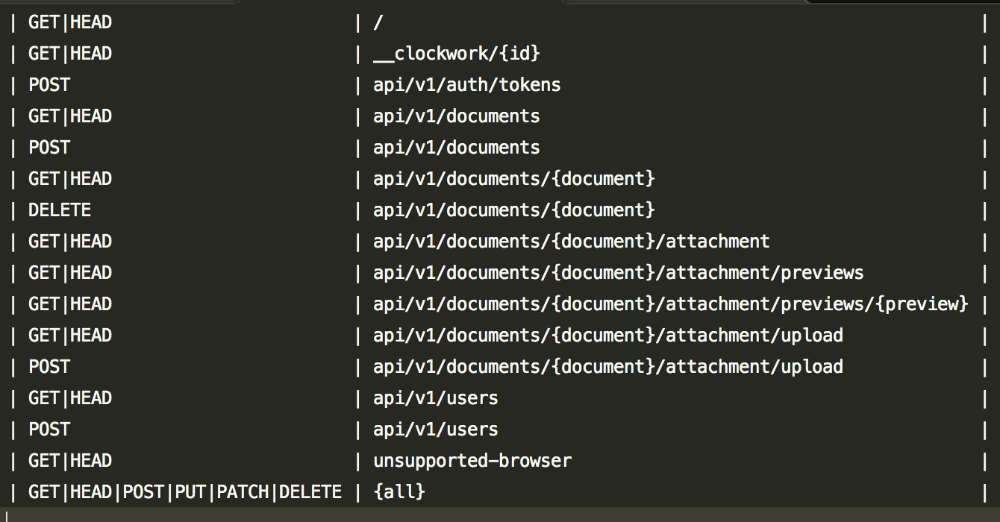

1. Create single page app with thumbnails of the first page of PDF document. There should be 4 x 5 thumbnails per page.
1. When clicking on thumbnail, full document should be shown in full screen modal window.
1. On top of the list page there is "add new document" button with document upload window.
1. Once document is uploaded, it is shown at the end of the thumbnails list.
1. All communication from the front to backend should be through REST API.
1. Use any database of your choice (MySQL, PostgreSQL, SQLite, Redis, NoSQL, ....)
1. For backend/front please use Laravel or Lumen.
1. For frontend you are free to use any framework of your choice.
1. Code should be delivered using gitlab, github, or bitbucket
1. Code should be PSR-2 valid
1. Code should be covered with functional tests (optional)

Bonus points:

* Use lumen instead of laravel
* Use docker
* Use all your knowledge of laravel or lumen, S.O.L.I.D. principles
* Use codebase from PHP 7.1 and 7.2
* Connect StyleCI, Scrutinizer, TravisCI (optional)

Routing example:

