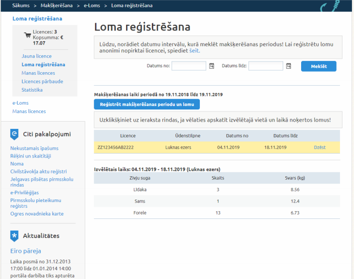
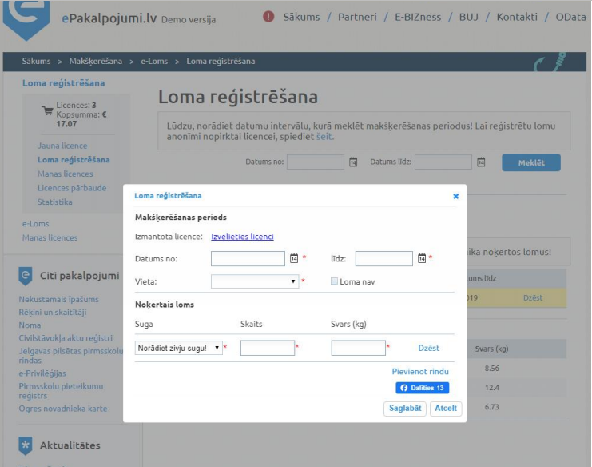
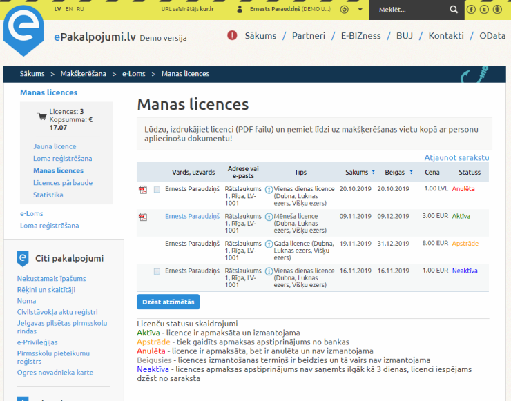

## Task

1. Provide suggestions on how the elements of the form would need to be arranged for use on mobile devices.

2. Choose any of the available https://www.epakalpojumi.lv/odata data sources. Using only  HTML / CSS / JS create a representation of any of the data structures.